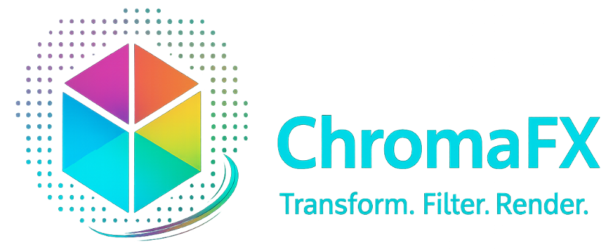



[](https://github.com/chromafx/chromafx/actions) 
[](https://www.nuget.org/packages/ChromaFx/) 
[](https://www.nuget.org/packages/ChromaFx.Legacy/) 
[](LICENSE)

Modern, high-performance .NET image processing and drawing library.  

**Key points:**
- Pure C#, zero dependency implementation
- Image encoding/decoding (PNG, JPEG, GIF, BMP)
- Drawing primitives and effects
- Pipeline-friendly API for efficient image processing

## Packages

ChromaFX is distributed as multiple NuGet packages to suit different needs:

| Package                | Description                                                                 | NuGet Link                                               |
|------------------------|-----------------------------------------------------------------------------|----------------------------------------------------------|
| `ChromaFx`             | Main package. Modern, high-performance image processing for .NET 8+.        | [ChromaFx](https://www.nuget.org/packages/ChromaFx/)     |
| `ChromaFx.Core`        | Core types and abstractions for ChromaFX.                                   | [ChromaFx.Core](https://www.nuget.org/packages/ChromaFx.Core/) |
| `ChromaFx.IO`          | Image file IO, encoding/decoding support.                                   | [ChromaFx.IO](https://www.nuget.org/packages/ChromaFx.IO/) |
| `ChromaFx.Processing`  | Image processing algorithms and effects.                                    | [ChromaFx.Processing](https://www.nuget.org/packages/ChromaFx.Processing/) |
| `ChromaFx.Legacy`      | Compatibility package for legacy .NET projects and APIs.                    | [ChromaFx.Legacy](https://www.nuget.org/packages/ChromaFx.Legacy/) |

- Use `ChromaFx` for new projects targeting .NET 8 or later.
- Use `ChromaFx.Core`, `ChromaFx.IO`, and `ChromaFx.Processing` for modular usage or advanced scenarios.
- Use `ChromaFx.Legacy` if you need support for older APIs or migration from previous versions.

Provides backward compatibility with the original Structure.Sketching API surface. Use only if migrating existing projects — for new development, prefer ChromaFx

## Installation
Install via NuGet package:

```bash
dotnet add package ChromaFx
```

For modular usage:

```bash
dotnet add package ChromaFx.Core
dotnet add package ChromaFx.IO
dotnet add package ChromaFx.Processing
```

For legacy support:

```bash
dotnet add package ChromaFx.Legacy
```

## Getting Started
### Classic API (currently available)
```csharp
using ChromaFx;
using ChromaFx.IO;
using ChromaFx.Processing;
using ChromaFx.Processing.Transforms;

class Program
{
    static void Main()
    {
        // Load an image from file
        var image = Image.Load("input.png");

        // Apply processing using the Apply() method
        image = image.Apply(new Resize(200, 200))
                     .Apply(new Rotate(90))
                     .Apply(new Invert());

        // Save the result
        image.Save("output.png");
    }
}
```

### Modern API ⚠️ (preview / in development)
```csharp
using ChromaFx;

class Program
{
    static void Main()
    {
        var image = Image.Load("input.png")
                         .Process(p => p
                             .Resize(200, 200)
                             .Rotate(90)
                             .Invert()
                         )
                         .Save("output.png");
    }
}
```


## Requirements
- .NET 8 or later

## License
Apache 2.0 - see [LICENSE](LICENSE)

## Attribution
This project is a fork of [Structure.Sketching](https://github.com/JaCraig/Structure.Sketching),
originally developed by JaCraig under the Apache License 2.0.

Modifications and ongoing maintenance by Ho Tzin Mein (2023–2025).

## Roadmap
- ✅ **Modularization** – Core, IO, Processing, and Legacy packages split out.  
- 🔜 **API Modernization** – Introducing a cleaner, pipeline-friendly API (breaking changes).  
- ⏭ **Extended Features** – Advanced algorithms such as pixel upscaling, new filters, and effects.

## Contributing
Contributions, bug reports, and suggestions are welcome!
The roadmap may evolve as the project grows — feel free to open an issue or pull request
if you'd like to help shape ChromaFX.